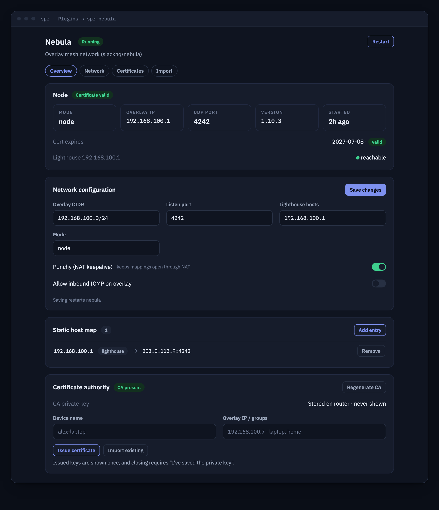

# spr-nebula



[Nebula](https://github.com/slackhq/nebula) overlay mesh networking for the
[SPR — Secure Programmable Router](https://github.com/spr-networks/super).

The plugin builds `nebula` and `nebula-cert` from source (pinned to the release
commit), runs the daemon in its own container with a management backend on the
SPR plugin unix socket, and ships a UI (embedded under **Plugins → spr-nebula**
in the SPR app as an iframe) for network configuration and certificate
management.

## Features

- Run this router as a nebula **node** or **lighthouse**
- Full config from the UI/API: lighthouses, static host map, listen port,
  overlay CIDR, relays, punchy (NAT hole punching)
- Built-in certificate authority: create a CA on the router — the CA private
  key is written to `/configs/spr-nebula/ca.key` (mode 0600) and **can never be
  retrieved through the API**
- Issue device certificates (name + overlay IP + groups); the device private
  key is returned exactly once in the API response and is never persisted on
  the router (unless you install the pair as this router's own identity)
- Join an existing network by importing `ca.crt` + a host certificate/key
- Status: daemon state, tun interface, overlay IP, lighthouse reachability
  (ICMP over the overlay), node certificate details
- Generated nebula firewall defaults to **outbound-any / inbound-deny**, with
  an optional "allow inbound ICMP" toggle (an allow-ICMP example is also
  documented inline in the generated `nebula.yml`)

## Install (UI)

In the SPR app go to **Plugins → + New Plugin** and add:

```
https://github.com/spr-networks/spr-nebula
```

SPR clones the repo into `plugins/user/spr-nebula`, builds the compose file and
starts the container.

## Install (CLI)

```sh
./install.sh
```

Prompts for your SPR directory (`/home/spr/super/`) and an SPR API token
(generate one under **Auth → API Tokens**), writes
`configs/plugins/spr-nebula/`, builds and starts the container, and registers
the `spr-nebula` custom interface with the `wan` + `dns` policies.

## Quick start

**New network (this router is the lighthouse):**
1. Certificate Authority → *Create CA*.
2. Network Configuration → enable *Run as lighthouse*, set the overlay CIDR
   (e.g. `192.168.100.0/24`) and UDP listen port (default `4242`).
3. Issue Device Certificate with *Install as this router's identity* for the
   router itself (e.g. `192.168.100.1`), then issue certs for your devices and
   copy/download each cert+key pair (the key is shown once).
4. Add an SPR **UDP port forward** for the listen port to the `spr-nebula`
   container IP so remote nodes can reach the lighthouse (see Security model).
5. Save.

**Join an existing network:** import the network `ca.crt` and a host cert/key
issued for this router (or paste your own CA), configure the lighthouses +
static host map, Save.

## API

All endpoints are served on the plugin unix socket
(`/state/plugins/spr-nebula/socket`) and proxied by SPR at
`/plugins/spr-nebula/…` with SPR API authentication.

| Method | Path | Description |
| --- | --- | --- |
| GET | `/status` | Daemon/interface state, overlay IPs, lighthouse reachability, node cert info, nebula version, daemon start time |
| GET | `/topology` | Overlay graph for SPR's topology view (see below) |
| GET | `/config` | Plugin config + `CAConfigured`/`CertConfigured` (never any key material) |
| PUT | `/config` | Validate + save config, regenerate `nebula.yml`, (re)start or stop the daemon |
| POST | `/restart` | Regenerate config and restart nebula |
| POST | `/ca` | Generate a CA. Body: `{"Name","Duration","Force"}`. Returns the CA **certificate** only; the key is stored 0600 and never returned. 409 if a CA exists and `Force` is not set |
| GET | `/ca` | CA certificate (public part) |
| POST | `/certs` | Sign a node cert. Body: `{"Name","IP","Groups","Duration","Install"}`. Returns `{Cert,Key}` — the key appears **only in this response** and is not stored. With `Install:true` the pair becomes this router's identity (`host.crt`/`host.key`, key persisted 0600, not returned) |
| POST | `/keys/import` | Import `{"CACert","HostCert","HostKey"}` PEM to join an existing network (host cert+key must come together) |

### Topology (`GET /topology`)

The plugin contributes its overlay graph to SPR's router topology view
(`"HasTopology": true` in `plugin.json`). The response is
`{"Nodes":[...],"Edges":[...]}` using the same node/edge shapes as
spr-tailscale:

- a root anchor node `{"ID":"root","ConnType":"nebula","Online":true}` —
  the SPR host merges the plugin graph into the router topology at this node
- one node per configured lighthouse (`Kind:"lighthouse"`) and per static
  host map entry (`Kind:"host"`), with `IP` set to the overlay IP. `Online`
  comes from the live lighthouse reachability probe where one ran, otherwise
  it reflects the daemon being up
- one edge per node toward the root: `{"From":"<overlay IP>","To":"root",
  "Layer":"nebula","Kind":"nebula"}`

When the nebula daemon is not running the graph is the root anchor only.

### Configuration reference (`PUT /config`)

| Field | Type | Meaning |
| --- | --- | --- |
| `Enabled` | bool | Run the nebula daemon |
| `Mode` | string | `node` or `lighthouse` |
| `CIDR` | string | Overlay network, e.g. `192.168.100.0/24`; default prefix for issued certs |
| `ListenPort` | int | UDP port inside the container network (`0` = random, node mode only; lighthouses require a fixed port) |
| `LighthouseHosts` | []string | Overlay IPs of lighthouses (node mode; each needs a `StaticHostMap` entry) |
| `StaticHostMap` | map[string][]string | Overlay IP → list of `host:port` real-world addresses |
| `Relays` | []string | Overlay IPs of relays this node may use |
| `AmRelay` | bool | Advertise this node as a relay |
| `UseRelays` | bool | Use relays learned from lighthouses |
| `Punchy.Punch` / `Punchy.Respond` | bool | NAT hole punching behavior |
| `InboundAllowICMP` | bool | Add an inbound overlay-firewall rule allowing ICMP (default: inbound deny-all) |

All input is allow-list validated server-side; values reach `nebula-cert` only
as argv arrays (never a shell) and reach `nebula.yml` only after strict charset
validation plus quoting.

## Security model

- **No published host ports.** The management API is only reachable over the
  plugin unix socket via the authenticated SPR API. Nebula's UDP port is bound
  inside the container on the plugin's own docker bridge (`spr-nebula`).
  Outbound connectivity and NAT hole punching work as-is; if remote nodes must
  reach *this* node directly (lighthouse or relay duty), add an SPR **UDP port
  forward** from the WAN to the `spr-nebula` container IP for the listen port —
  the plugin deliberately does not publish ports itself.
- **Container privileges:** `NET_ADMIN` plus the `/dev/net/tun` device — the
  minimum for nebula to create its tun interface. `no-new-privileges` is set;
  the container is not privileged and mounts only the SPR plugin state/config
  paths.
- **Key handling:** the CA key (`ca.key`) and node key (`host.key`) live in
  `configs/plugins/spr-nebula/` with mode 0600 and are never returned by any
  endpoint. `GET /config` contains no secrets. Device keys from `POST /certs`
  exist only in the one-time response.
- **Overlay firewall:** the generated nebula config denies all inbound overlay
  traffic and allows all outbound by default. Enable inbound ICMP with the
  toggle, or extend the generator for finer rules.
- **SPR policies:** the container gets `wan` (UDP to lighthouses/peers) and
  `dns` (resolve static host map hostnames) only.

## Reproducible builds

All build inputs are pinned in [`reproducible.env`](reproducible.env): base
image digests, the Go toolchain (version + sha256 per arch), the Ubuntu
snapshot used for apt, and nebula itself (`NEBULA_VERSION` + `NEBULA_COMMIT`,
the full commit hash of the release tag). `nebula`/`nebula-cert` are built from
source at that commit — no prebuilt binaries.

- [`build_docker_compose.sh`](build_docker_compose.sh) — reproducible local
  build (buildkit pinned, `SOURCE_DATE_EPOCH=0`, timestamps rewritten)
- [`update-pins.sh`](update-pins.sh) — re-resolve every pin (registry digests,
  latest Go patch release, latest nebula release tag → commit hash) and sync
  the Dockerfile ARG defaults

## Development

```sh
cd code && go test ./...     # backend unit tests (config validation, yaml generation)
cd frontend && yarn install && yarn run bundle   # build the UI into build/index.html
```

## Upstream

- Nebula: <https://github.com/slackhq/nebula> — MIT licensed by Slack
  Technologies, built from source at the pinned release commit.
- This plugin: MIT (see [LICENSE](LICENSE)).
